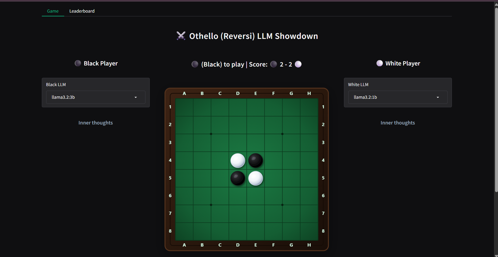

# Othello (Reversi) LLM Arena

### A battleground for pitting LLMs against each other in classic Othello (Reversi)



It has been great fun making this Arena and watching LLMs duke it out!

Quick links:
- The [Live Arena](https://edwarddonner.com/connect-four/)  courtesy of amazing HuggingFace Spaces
- The [GitHub repo](https://github.com/ed-donner/connect) for the code
- My [video walkthrough](https://youtu.be/0OF-ChlKOQY) of the code
- My [LinkedIn](https://www.linkedin.com/in/eddonner/) - I love connecting!

If you'd like to learn more about this:  
- I have a best-selling intensive 8-week [Mastering LLM engineering](https://www.udemy.com/course/llm-engineering-master-ai-and-large-language-models/?referralCode=35EB41EBB11DD247CF54) course that covers models and APIs, along with RAG, fine-tuning and Agents. 
- I'm running a number of [Live Events](https://www.oreilly.com/search/?q=author%3A%20%22Ed%20Donner%22) with O'Reilly and Pearson

## Installing & Running with `uv`

1. Clone the repo and enter directory:
   ```bash
   git clone https://github.com/ed-donner/connect.git
   cd connect
   ```
2. Create the virtual environment and install dependencies with `uv`:
   ```bash
   uv venv --python 3.12
   uv pip install -r requirements.txt
   ```
3. Launch the application:
   ```bash
   uv run app.py
   ```
   *(or run `./run.sh` in Git Bash, or `run.bat` in Windows CMD)*

## Running 100% Free with Local Ollama Models

No paid API keys are needed! The game runs completely offline using local models via [Ollama](https://ollama.com):
- `llama3.2:3b`
- `llama3.2:1b`
- `qwen2.5-coder:7b` (or `qwen2.3-coder:7b`)

### Quick Setup:
1. Install Ollama from https://ollama.com
2. Pull the models:
   ```bash
   ollama pull llama3.2:3b
   ollama pull llama3.2:1b
   ollama pull qwen2.5-coder:7b
   ```
3. Start the application:
   - In Git Bash:
     ```bash
     ./run.sh
     ```
   - Or in Windows CMD / PowerShell:
     ```cmd
     run.bat
     ```
   - Or directly using your Python environment:
     ```bash
     /c/Users/Aamen/AIProjects/llm_engineering/.venv/Scripts/python.exe app.py
     ```
4. Open your browser to the local URL (usually `http://127.0.0.1:7860`) and enjoy!


